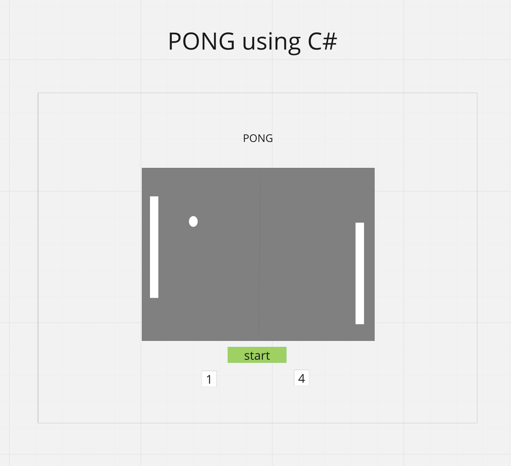
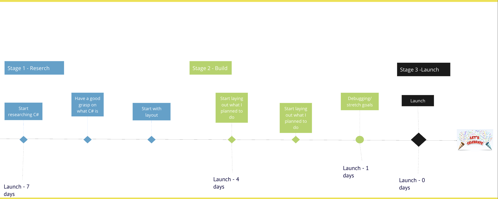

# PONG-V2.0

## Synopsis
#### Venturing into new territories with C#, I'm set to reimagine my inaugural solo project - a PONG game initially crafted in JavaScript. This endeavor is not just a coding exercise, but a thrilling challenge to elevate my skills. Here's to a journey of growth, learning, and conquering new frontiers. Welcome to my C# adventure!

## WireFrame

## Timeline

## Technologies
* C#
* Unity
* C# extension

## User stories (MVP)
* As a user, I want to be able to play the game on my desktop using my up,down, W, and S keys to move the posts.
* As a user, I want the app to be responsive and bug free.
* As a user, I want to see my score in real time.
* As a user, I want to be able to play aginst the computer. 
## Strech Goals
* As a user, I want to be able to play this game on the web.
* As a user, I want to be able to play it on mobile.
* As a user, I want to choose the speed of the ball.
* As a user, I want to be able to play with ramdoms online.
* As a user, I want to be able to choose the level of difficulty.
* As a user, I want to play other games in the site.

## Roadblocks I have faced
#### Undoubtedly, this experience was intellectually stimulating and enlightening, although it presented a fair share of challenges. Primarily, my task was to grasp the fundamentals of C# within a span of one week. Among the many intricacies of the language, one particular aspect that consistently proved to be a hurdle was the correct use of semicolons. The frequency with which I overlooked this seemingly minor detail resulted in countless occasions where I was compelled to revisit my code. The process of painstakingly combing through lines of code to identify a single omission was time-consuming and often took upwards of thirty minutes.

#### In the initial stages, harnessing the power of Unity to create functioning models seemed like an arduous task. However, with concerted effort in reading relevant literature and watching instructional tutorials, my understanding gradually improved, enabling me to utilize Unity effectively.

## Resources
* https://www.w3schools.com/cs/cs_intro.php
* https://learn.microsoft.com/en-us/dotnet/core/tutorials/top-level-templates
* https://learn.microsoft.com/en-us/dotnet/api/system.windows.style?view=windowsdesktop-7.0
* https://www.w3schools.com/cs/cs_syntax.php
* https://www.w3schools.com/cs/cs_getstarted.php
* https://docs.unity3d.com/Manual/PublishingBuilds.html
* https://www.w3schools.blog/unity-load-scene